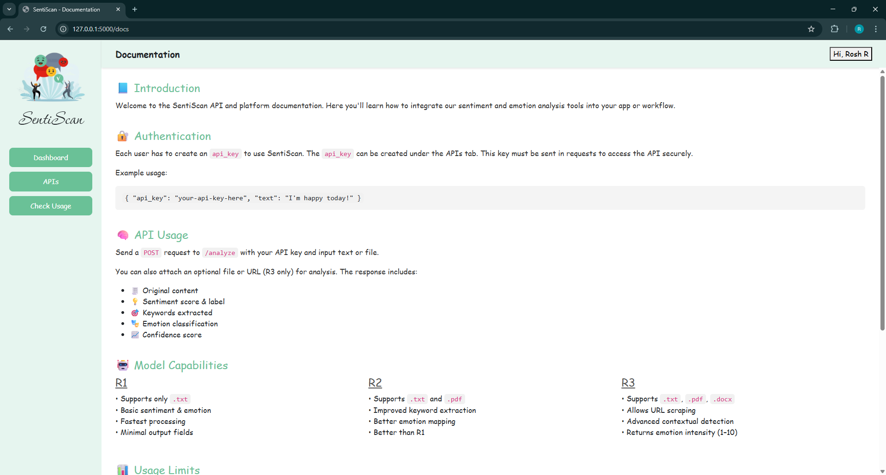
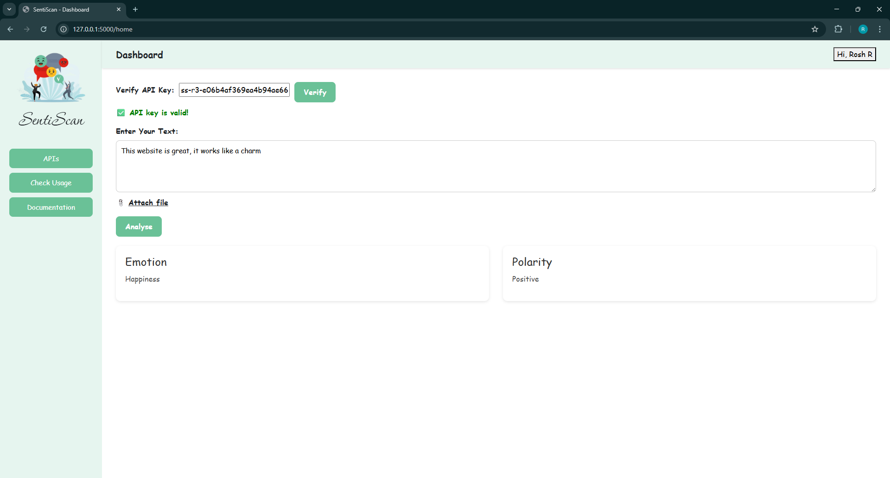

# SentiScan 
AI-Powered Sentiment & Emotion Analysis API Provider Web App

-----------------------
**SentiScan** is a full-stack Flask-based API provider web application that allows users to:
- Generate API keys of different sentiment models (R1, R2, R3) to integrate it with their app or workflow
- Analyze text, files, or URLs for emotional tone and sentiment polarity
- Track daily usage and visualize results via dynamic charts
- Organize API keys into projects for grouped analysis
------------------------
## Key Features

| Feature             | Description                                                  |
|---------------------|--------------------------------------------------------------|
| API Key Management | Generate, delete, assign API keys to projects                |
| Usage Dashboard    | Visual breakdown of emotions, polarity, keywords             |
| Project Analysis   | Aggregate tone analysis across all keys in a project         |
| File & URL Support | Analyze `.txt`, `.pdf`, `.docx`, and scrape from URLs (R3 only) |
| Authentication System | Register/Login with validations, email confirmation          |
| Model Variants     | R1 (Basic), R2 (Better), R3 (Advanced + URL)        |

-----------------------
## ️Tools
- **Frontend**: HTML5, CSS3, JavaScript, Bootstrap 5
- **Backend**: Python Flask
- **Database**: MongoDB (NoSQL)
- **Auth**: bcrypt, Flask Sessions
- **ML API**: Groq (LLama-4 via API)
- **PDF/Docx Parsing**: PyPDF2, python-docx
- **Charts**: Highcharts.js
-------------------------
## Model Capabilities
| Model | File Support          | Features                                                                 |
|-------|-----------------------|--------------------------------------------------------------------------|
| R1    | `.txt`                | Basic sentiment & emotion analysis                                      |
| R2    | `.txt`, `.pdf`        | Improved keyword + emotion mapping                                      |
| R3    | `.txt`, `.pdf`, `.docx`, URL | Emotion intensity scoring, advanced context                        |
------------------------
## ️ Local Setup

1. Clone the repository
   ```bash
   git clone https://github.com/RoshRaj01/sentiscan.git
   cd sentiscan
2. Install dependencies
   ```bash
   pip install flask pymongo bcrypt requests dnspython python-dotenv pypdf2 python-docx beautifulsoup4

3. Setup your config.py
    ```ini
   DB_URL = your_mongodb_url
   GROQ_API_KEY = your_groq_api_key
   SECRET_KEY = your_secret

4. Run the app through the terminal
    ```bash
   python app1.py

5. Visit: http://localhost:5000
-------------------------

##  API Usage Example
POST: http://127.0.0.1:5000/api/analyze

**Body:**

    {
      "api_key": "ss-r3-xxxx",
      "text": "I feel great today!"
    }

**Response:**

    {
      "predicted_emotion": "Joy",
      "predicted_polarity": "Positive"
    }
--------------------

## Screenshots📸
**Documentation**




**Dashboard**



**API Management**


**API Management**


